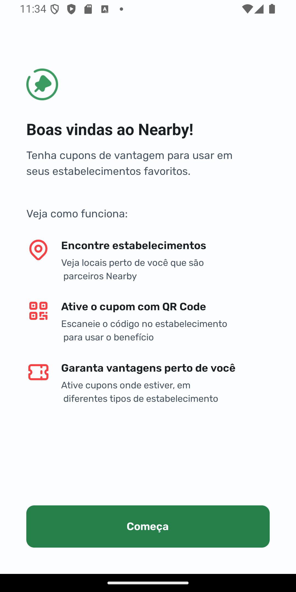
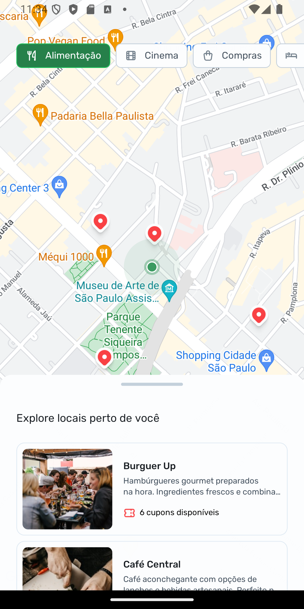
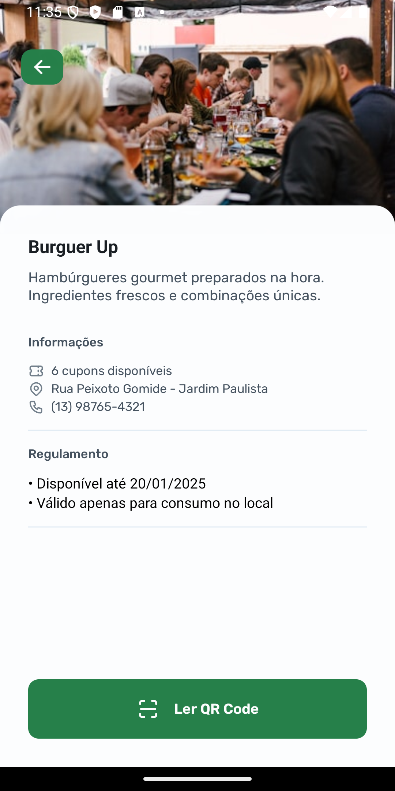

#  Nearby

- Aplicação usando React Native
- Usando Expo
- Usando NativeWind
- axios
- react-native-gesture-handler
- Expo Camera
- Expo Location
- Expo MapView
- react-native-bottom-sheet

## Rodar o projeto

- primeiro instalar o nodejs versão LTS
- npm install para instalar todas as dependência
- npm start ou npx  expo  start para executar o projeto 